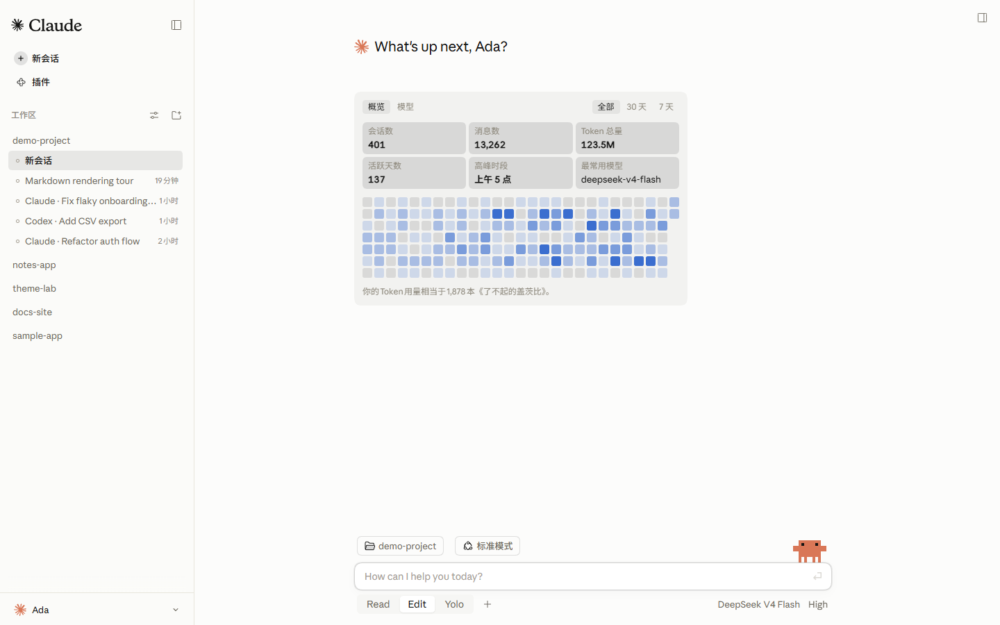
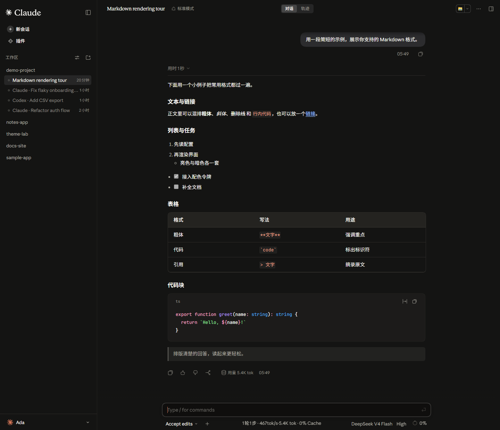
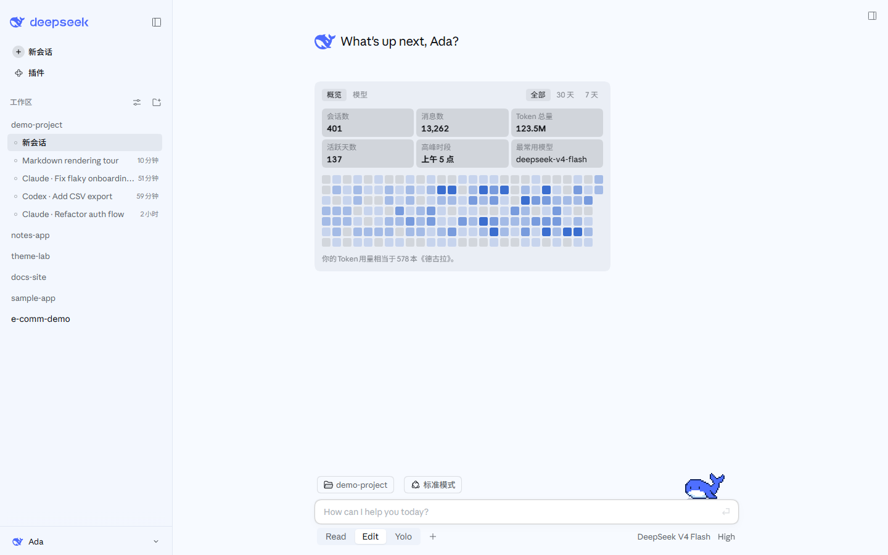
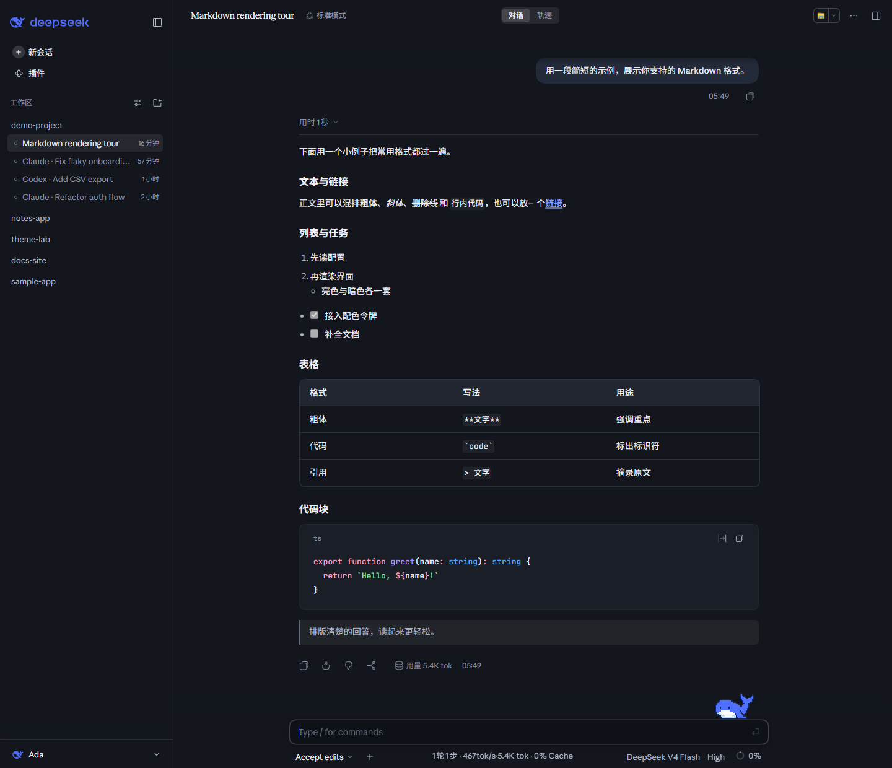
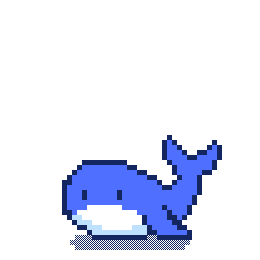
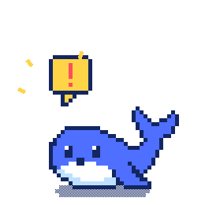

<div align="center">

# DSH Claude Style

**A theme plugin that brings the look and feel of Claude Code Desktop to the DeepSeek Harness Web GUI.**

> **Claude Code Desktop, right inside DSH.**

[](README.en.md) [](README.md)

[](https://www.npmjs.com/package/dsh-claude-style)
[](https://www.npmjs.com/package/dsh-claude-style)
[](https://github.com/Nwflower/dsh-claude-style)
[](https://www.dsh.so/artifact/dsh-claude-style/)
[](LICENSE)

</div>

## Preview

The settings page's Brand mark row switches between the Claude and DeepSeek palettes, and light/dark follows your system's color mode. In each group the top row is the Studio home page and the bottom row a Markdown conversation, light on the left and dark on the right.

### Claude

<table>
  <tr>
    <td align="center" width="50%"></td>
    <td align="center" width="50%"></td>
  </tr>
  <tr>
    <td align="center" width="50%"></td>
    <td align="center" width="50%"></td>
  </tr>
</table>

> Light mode pairs an ivory canvas `#FCFCFB` with a pale sidebar `#FBFBF9`; dark mode uses warm black `#141413`. Ember orange `#D97757` is the single action accent across both canvases, and Claude Code's pixel crab stands on the composer on the home page and in conversations alike.

### DeepSeek

<table>
  <tr>
    <td align="center" width="50%"></td>
    <td align="center" width="50%"></td>
  </tr>
  <tr>
    <td align="center" width="50%"></td>
    <td align="center" width="50%"></td>
  </tr>
</table>

> Light mode is a white with a touch of sky blue, `#F7FAFF`, with the sidebar at `#F3F7FE`; dark mode is a blue-black `#13161D`. The accent is DeepSeek's brand blue `#4D6BFE`, and Deepy the pixel whale stands on the composer on the home page and in conversations alike.
>
> <table>
>   <tr>
>     <td align="center" width="25%"><br />Idle</td>
>     <td align="center" width="25%"><br />Thinking</td>
>     <td align="center" width="25%"><br />Answering and calling tools</td>
>     <td align="center" width="25%"><br />Conducting subagents</td>
>   </tr>
>   <tr>
>     <td align="center" width="25%"><br />Waiting on you</td>
>     <td align="center" width="25%"><br />Failed</td>
>     <td align="center" width="25%"><br />Finished</td>
>     <td align="center" width="25%"><br />Asleep</td>
>   </tr>
> </table>

> The workspaces, sessions, usage figures and nickname in the screenshots are sample data.

## Features

<!-- features:start — written by npm run readme, not by hand -->

- **Selection colour while unfocused**: Selected text takes the unfocused colours while the window is in the background and the focused ones when it comes back, as other applications do.
- **Composer**: The input card on the new-conversation page and in conversations is redrawn after Claude Code Desktop: attachments sit in one row of tiles, the context usage is a ring in the toolbar, a press anywhere on the card starts typing, and a conversation resting at the bottom moves up with the card as it grows. The Composer tab chooses the home page alone, the conversation alone, both, or neither.
- **Home layout**: Classic is the centred greeting over the input card. Studio moves the greeting to the top left, pins the input card to the window's bottom edge and fills the space between with a usage panel: a heat map of recent usage and the usage and cost of each model.
- **Mascot**: A pixel companion stands on the composer's top edge and changes its animation with what the agent is doing (thinking, writing and calling tools, several sessions at work, subagents, waiting on you, compacting the context, finished, failed, asleep). Follow the brand shows the pixel crab under Claude and Deepy the whale under DeepSeek; either can be picked for good, or none. Where it appears keeps it to the new-conversation page, or puts it in conversations as well.
- **Greeting and hint**: The new-conversation page greets you by name with a line that changes with the time of day, and the empty composer shows Claude's own hint.
- **Permission control**: The composer's permission menu becomes a row of segments. The presets are the host's own catalog, a plugin's preset included; the new-conversation page shows the one a new session will start in.
- **Session numbers**: The session statistics and the token usage move into the popover of the composer's context ring and follow the host's data live. It shares the permission control's switch: both take over the composer's bottom line.
- **Model picker**: The composer's model menu becomes a two-level card: the first level holds the official service and the quick providers you picked, each model with its vendor mark and a line of description; the second level holds the rest.
- **Effort**: The reasoning effort gets a trigger of its own beside the model, opening a slider. It switches with the model picker, since the host keeps the effort inside its own model menu.
- **Home page directory and preset menus**: The directory and agent-preset menus on the new-conversation page are drawn as the skin's popover cards, parked over their own buttons, one open at a time.
- **Quick providers**: The settings page picks which providers' models the model picker's first level carries; a provider gone from the catalog is marked Removed and can be unchecked.
- **Sidebar account area**: The sidebar footer's settings entry folds into the account popover, which carries the account header, other plugins' footer entries and the settings row; on the desktop the host's own account menu is used.
- **Account-hold easter egg**: The account row at the top of the account popover opens a full-page replica of Claude's account-hold page. Every control on it, and Esc, closes it, and nothing it names actually happens. Its language is chosen on the General tab.
- **One-frame theme switch**: Switching between light and dark changes borders, shadows and fills in the same frame, instead of the colours first and the borders easing in after.
- **In progress / Archived**: The sidebar's workspace section splits into In progress and Archived; Archived is one flat list whose rows can be restored or deleted.
- **Sidebar search**: A search box in the sidebar's brand row opens a palette that finds sessions (titles and content), projects, plugins, Skills and shortcuts, through the host's own dialog and navigation.
- **Turn status line**: A running, stopped or failed turn shows its status at the end of the turn's work: the elapsed time, the output tokens and what the model is doing now (or that it stopped or failed); while the turn runs the line is pinned above the composer, so content arriving below no longer drags it around.
- **Conversation navigator**: The column of short marks at the conversation's right edge holds one per turn and follows where you are reading. Reach it with the pointer and it opens into a list: each row carries the message that started its turn and sits exactly where that turn's mark was — the turn you are reading stays in place, and the turn under the pointer is still under it. The wheel scrolls the list and a click glides the page to the turn, loading earlier history first when it is not loaded yet; the Chat / Trajectory tabs at the top of the conversation stay up while the pointer is on the list. Alt+↑ / Alt+↓ jump to the previous or the next turn, and held or repeated they keep stepping; while the composer holds a draft the keys stay with it. The turn you land on flashes a short line over its start. With [dsh-plugin-msg-nav](https://github.com/SherUnlocked-4869/dsh-plugin-msg-nav) installed too, Alt+↑ / Alt+↓ stay with that plugin.
- **Chat-area follow**: At the structural moments — a thinking row folding, a tool call row arriving — a reader sitting at the bottom is handed back to the host's own follow, instead of being left tens of pixels short by the burst of content; a process group capped in the Standard and Compact tiers (thinking and tool output kept in one scrolling body) is caught up the same way. Catching up runs on a curve: a trickle of characters settles softly and a burst glides at one steady speed before landing. While content streams, the main scroller's own follow is walked along that curve too rather than written to the end in a single frame — with a fast stream the newest lines trail just below the fold and slide into place once it stops. A message you send does not go through it: the host's scroll to bring it into view lands at once. Once the reader scrolls away from the bottom himself, the plugin stays out of it until he returns.
- **Automatic folding and the rolling door**: A thinking row opens while the model reasons and folds back when it stops; a running process group opens and folds back once that piece of work ends. A row or group the reader pressed himself keeps what he chose for that phase. Opening or closing a row (a tool card, a thinking row, a command card) or a process group moves the height frame by frame, really pushing the content below away or pulling it back. The door only rolls the stretch the reader can see, so any length moves at the same speed, and a body holding several cards rolls as one door.
- **New text fades in**: Characters arriving in a streaming answer start faint and settle over about 0.12 s, staggered slightly by arrival order; a block arriving whole, a burst of thousands of characters and text that just reflowed from a fold stay solid.
- **File change rows**: A write or edit dispatched from inside a run_code program carries the `+n -m` tail and an expandable diff card, and its path opens the file; a failed or interrupted row keeps its verdict.
- **Send flight**: On submission the composer card lifts as it is and narrows into the bubble as it travels, its words re-flowing into the shape, landing on the message row: the real bubble shows underneath and the flying copy fades out, so the words sharpen into place.
- **Composer caret motion**: The composer's text caret is drawn by the plugin and glides when it moves; a question card's answer box and a queued message's inline editor are covered as well. The Conversation tab offers Every move (the default), Explicit moves and Off.
- **Chat / Trajectory tabs**: The Chat / Trajectory tab strip at the top of the conversation is redrawn as a segmented control and lifted onto the title's line when it fits.
- **Settings page**: The settings page appears both in the settings dialog (the "Claude Style" tab) and on the plugin page, in five tabs: General, Appearance, Composer, Sidebar and Conversation. Every feature that takes over part of the host's interface has its own switch; turning it off brings the host's original back at once, without a reload.

<!-- features:end -->

## Settings

The settings page appears both in the settings dialog (the "Claude Style" tab) and on the plugin page, in five tabs:

| Tab | Settings |
|---|---|
| General | Username, Animation, Open popovers on hover, Account-hold easter egg language |
| Appearance | Brand mark, Colours, Typefaces, Mascot, Where it appears |
| Composer | Composer restyle, Home layout, Redraw the model picker (with Quick providers under it), Redraw the permission control |
| Sidebar | Collapse the sidebar settings area, Sidebar search, In progress / Archived view |
| Conversation | Turn status line, Conversation navigator, Chat-area animations, Composer caret motion, Chat / Trajectory tabs |

Every feature that takes over part of the host's interface has its own switch; turning it off brings the host's original back at once, without a reload. The conversation area's animations — the follow, the automatic folding with its rolling door, the text fade, the file change rows and the send flight — share one Chat-area animations switch; the caret keeps its own three-way choice.

**Alongside other theme plugins**: with Colours and Typefaces set to Follow the host, the skin no longer rewrites the host's colours and fonts and keeps only its layout and controls; the colours are left to DSH itself, or to another theme plugin enabled at the same time. With [dsh-wallpaper-engine](https://github.com/elysia395/dsh-wallpaper-engine), for example, the wallpaper shows through the sidebar and the conversation, and the skin's own popovers take that plugin's glass, translucent and blurring the picture behind them. **Alongside [dsh-chat-ux](https://github.com/alm-allen/dsh-chat-ux)**: that plugin implements the same chat-area interactions (the rolling door, automatic folding, the token fade, file change rows, the send flight, the drawn caret), and two copies of them intercept each other's clicks and press the same controls. So this skin stands down when it sees that plugin: the Chat-area animations and Composer caret motion rows on the settings page's Conversation tab have their controls disabled while each still shows the value you set, with a line underneath in the accent colour reading "Managed by dsh-chat-ux". Your settings are not rewritten, and they take effect as they are once dsh-chat-ux is removed.

**Chat-area follow**: at the structural moments — a thinking row folding, a tool call row arriving — a reader sitting at the bottom is handed back to the host's own follow, instead of being left tens of pixels short by the burst of content; a process group capped in the Standard and Compact tiers (thinking and tool output kept in one scrolling body) is caught up the same way. Catching up runs on a curve: a trickle of characters settles softly and a burst glides at one steady speed before landing. While content streams, the main scroller's own follow is walked along that curve too rather than written to the end in a single frame — with a fast stream the newest lines trail just below the fold and slide into place once it stops. A message you send does not go through it: the host's scroll to bring it into view lands at once. Once the reader scrolls away from the bottom himself, the plugin stays out of it until he returns.

**Automatic folding**: a thinking row opens while the model reasons and folds back when it stops; a running process group opens and folds back once that piece of work ends. A row or group the reader pressed himself keeps what he chose for that phase.

**Send flight**: on submission the composer card lifts as it is and narrows into the bubble as it travels, its words re-flowing into the shape, landing on the message row: the real bubble shows underneath and the flying copy fades out, so the words sharpen into place.

**File change rows**: a write or edit dispatched from inside a run_code program carries the `+n -m` tail and an expandable diff card, and its path opens the file; a failed or interrupted row keeps its verdict.

**New text fades in**: characters arriving in a streaming answer start faint and settle over about 0.12 s, staggered slightly by arrival order; a block arriving whole, a burst of thousands of characters and text that just reflowed from a fold stay solid.

**A rolling door for folds**: opening or closing a row (a tool card, a thinking row, a command card) or a process group moves the height frame by frame, really pushing the content below away or pulling it back. The door only rolls the stretch the reader can see, so any length moves at the same speed, and a body holding several cards rolls as one door. It rides the Chat-area animations switch, together with the entrance fade of an expanded body.

**Composer caret motion**: the composer's text caret is drawn by the plugin and glides when it moves; a question card's answer box and a queued message's inline editor are covered as well. The Conversation tab offers Every move (the default), Explicit moves and Off.

**Conversation navigator**: the column of short marks at the conversation's right edge holds one per turn and follows where you are reading. Reach it with the pointer and it opens into a list: each row carries the message that started its turn and sits exactly where that turn's mark was — the turn you are reading stays in place, and the turn under the pointer is still under it. The wheel scrolls the list and a click glides the page to the turn, loading earlier history first when it is not loaded yet; the Chat / Trajectory tabs at the top of the conversation stay up while the pointer is on the list. Alt+↑ / Alt+↓ jump to the previous or the next turn, and held or repeated they keep stepping; while the composer holds a draft the keys stay with it. The turn you land on flashes a short line over its start. With [dsh-plugin-msg-nav](https://github.com/SherUnlocked-4869/dsh-plugin-msg-nav) installed too, Alt+↑ / Alt+↓ stay with that plugin.

**Mascot**: a pixel companion stands on the composer's top edge and changes its animation with what the agent is doing (thinking, writing and calling tools, several sessions at work, subagents, waiting on you, compacting the context, finished, failed, asleep). Follow the brand shows the pixel crab under Claude and Deepy the whale under DeepSeek; either can be picked for good, or none. Where it appears keeps it to the new-conversation page, or puts it in conversations as well.

## Fonts

> **Important: the Anthropic fonts are not bundled with the npm package.** They are available for download in this repository under [`packages/assets/src/fonts/anthropic/`](packages/assets/src/fonts/anthropic/). You can either install them on your system, or skip the install entirely — drop the two `.ttf` files into `$DSH_HOME/dsh-claude-style/fonts/` (`~/.dsh/dsh-claude-style/fonts/` when `DSH_HOME` is unset) and the host will serve them as webfonts (the files are identical, so the result is the same). Either way, refresh or restart the web UI for the fonts to take effect.

| Font | Used for | File |
|---|---|---|
| Anthropic Sans Web Text | Interface / UI | [`packages/assets/src/fonts/anthropic/AnthropicSansWebText.ttf`](https://github.com/Nwflower/dsh-claude-style/raw/main/packages/assets/src/fonts/anthropic/AnthropicSansWebText.ttf) |
| Anthropic Serif Web Text | Conversation body / Markdown | [`packages/assets/src/fonts/anthropic/AnthropicSerifWebText.ttf`](https://github.com/Nwflower/dsh-claude-style/raw/main/packages/assets/src/fonts/anthropic/AnthropicSerifWebText.ttf) |
| JetBrains Mono Variable | Code / code blocks | [`packages/assets/src/fonts/JetBrainsMonoVariable.ttf`](https://github.com/Nwflower/dsh-claude-style/raw/main/packages/assets/src/fonts/JetBrainsMonoVariable.ttf), [`packages/assets/src/fonts/JetBrainsMonoItalicVariable.ttf`](https://github.com/Nwflower/dsh-claude-style/raw/main/packages/assets/src/fonts/JetBrainsMonoItalicVariable.ttf) |
| Inter | Interface when Anthropic Sans is absent | [`packages/assets/src/fonts/InterVariable.woff2`](https://github.com/Nwflower/dsh-claude-style/raw/main/packages/assets/src/fonts/InterVariable.woff2) |
| Noto Serif | Conversation body when Anthropic Serif is absent | [`packages/assets/src/fonts/NotoSerifVariable.woff2`](https://github.com/Nwflower/dsh-claude-style/raw/main/packages/assets/src/fonts/NotoSerifVariable.woff2) |

JetBrains Mono, Inter and Noto Serif are licensed under the SIL Open Font License 1.1 and ship with the npm package; nothing to set up. Inter and Noto Serif nearly match the two Anthropic fonts in letter height and width, so without the Anthropic fonts they stand in and the interface and conversation text keep their layout. Both carry only the Latin characters the Anthropic fonts cover; Chinese text keeps using the system's Chinese fonts.

To enable the Anthropic fonts, choose one of the following:

① Install them on your system — on Windows, double-click each `.ttf` and choose "Install"; on macOS, import them with Font Book.

② Skip the install — copy the `.ttf` files into `$DSH_HOME/dsh-claude-style/fonts/`, then refresh the page.

> The Anthropic Sans and Serif fonts are the property of Anthropic, licensed for personal use only, and are not covered by this project's MIT license.

## Skin center handoff

This theme is also offered as a **skin** in the DSH Skin Center. Selecting it there hands the whole page to this
plugin; selecting another skin or the official default takes the page back without a reload.

- The answer holds from the first frame: the Skin Center stamps `html[data-dsh-skin]` into the served document, so a
  page that boots with a skin already painting never flashes a frame of this theme first.
- While another skin paints the page this theme mounts no stylesheet, installs no feature and claims no document
  attribute at all. It takes the page back when the skin leaves and gives it back when a skin returns, a skin
  picked after the page loaded included.
- A wallpaper plugin is not another owner: while a wallpaper renders this theme keeps working, as described under
  "Alongside other theme plugins" above.
- The settings page and every stored preference survive the handoff. A skin taking the screen does not uninstall
  anything, and closing the Skin Center does not throw away what you configured here.
- `data-dsh-claude-style-handoff` on `body` marks a build that can do this; the Skin Center offers the row only
  while it is there.

## Installation

1. From the official plugin page, add the plugin below and it installs.

```
dsh-claude-style
```

2. From a terminal:

```bash
dsh plugin --profile web add dsh-claude-style                  # npm package (recommended)
dsh plugin --profile web add Nwflower/dsh-claude-style         # GitHub source
```

3. From the [plugin market](https://github.com/dsh-market/dsh-market)

Keep only one theme enabled at a time. dsh ≥ 0.1.7 is required, and a restart of DeepSeek Harness brings the full feature set.

## Documentation

| Document | Contents |
| --- | --- |
| [Design tokens](docs/STYLE.md) | Palette, typography, shapes, source layout, and host-selector discipline (in English) |
| [Architecture decisions](docs/decisions/README.md) | One file per decision: build and source, the host boundary, the runtime and each feature's trade-offs, and the architecture migration in progress (in Chinese) |
| [Changelog](CHANGELOG.md) | Version history |
| [Contributing](CONTRIBUTING.md) | Building from `packages/client/src/`, commit conventions, and the screenshot and regression tooling (in English) |

## Acknowledgements

The conversation navigator's opening list, keyboard jumps and landing line follow SherUnlocked-4869's [dsh-plugin-msg-nav](https://github.com/SherUnlocked-4869/dsh-plugin-msg-nav) (MIT).

The animation frames of Deepy the pixel whale come from the Deepy whale theme pack drawn by calmly-eating-bugs ([@wp3171216237](https://github.com/wp3171216237)), and ship with the plugin by the author's permission. Many thanks to the author! GIFs of all 20 animations, contributed by the author, are in [docs/gifs/](docs/gifs/).

The pixel crab (Clawd) is a character of Anthropic, and all rights in it remain with Anthropic. Its laptop animation is taken from Claude Code; the animations of its other states are drawn by this project after that character. The crab's frames are not covered by the MIT license (see [LICENSE](LICENSE)). This plugin is an unofficial fan work, not affiliated with or endorsed by Anthropic.

## Related projects

> Running several themes at once? Try [dsh-skin-manager](https://github.com/xiaoyangcheng84-svg/dsh-skin-manager) — it switches between all installed themes from a single settings page.

> Want to import your Claude Code / Codex session history into DSH and keep the conversation going? Try the author's other plugin, [dsh-chat-import](https://github.com/Nwflower/dsh-chat-import).

## Star History

[](https://star-history.com/#Nwflower/dsh-claude-style&Date)
