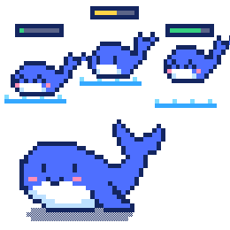
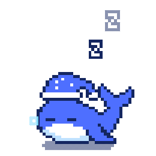

<div align="center">

# DSH Claude Style

**为 DeepSeek Harness 复刻 Claude Code Desktop 风格与交互体验的主题插件。**

> **在 DSH 里，就是 Claude Code Desktop 的样子。**

[](README.md) [](README.en.md)

[](https://www.npmjs.com/package/dsh-claude-style)
[](https://www.npmjs.com/package/dsh-claude-style)
[](https://github.com/Nwflower/dsh-claude-style)
[](https://www.dsh.so/artifact/dsh-claude-style/)
[](LICENSE)

</div>

## 预览

本插件提供了两种主题。通过插件设置，可以在 Claude 与 DeepSeek 两套配色之间切换，亮暗跟随系统颜色模式。

### Claude

<table>
  <tr>
    <td align="center" width="50%"></td>
    <td align="center" width="50%"></td>
  </tr>
  <tr>
    <td align="center" width="50%"></td>
    <td align="center" width="50%"></td>
  </tr>
</table>

> Claude品牌主题，原汁原味。工作台首页（上），对话界面（下），浅色（左），深色（右）

### DeepSeek

<table>
  <tr>
    <td align="center" width="50%"></td>
    <td align="center" width="50%"></td>
  </tr>
  <tr>
    <td align="center" width="50%"></td>
    <td align="center" width="50%"></td>
  </tr>
</table>

> DeepSeek品牌主题，拥有特色宠物小鲸鱼Deepy。工作台首页（上），对话界面（下），浅色（左），深色（右）
>
> <table>
>   <tr>
>     <td align="center" width="25%"><br />空闲</td>
>     <td align="center" width="25%"><br />思考</td>
>     <td align="center" width="25%"><br />写回答、调用工具</td>
>     <td align="center" width="25%"><br />指挥子代理</td>
>   </tr>
>   <tr>
>     <td align="center" width="25%"><br />等你操作</td>
>     <td align="center" width="25%"><br />失败</td>
>     <td align="center" width="25%"><br />完成</td>
>     <td align="center" width="25%"><br />睡着</td>
>   </tr>
> </table>

## 功能

<!-- features:start — written by npm run readme, not by hand -->

- **失焦时的选区颜色**：窗口失去焦点时，选中的文字换成失焦的配色，回到窗口时换回来，与系统里别的程序一致。
- **输入区**：新会话页与对话页的输入卡片按 Claude Code Desktop 的样子重画：附件排成一行缩略图，上下文用量是工具栏里的一个圆环，点卡片的空白处就能开始输入，卡片变高时停在底部的对话跟着上移。设置页「输入区」可以选只改新会话页、只改对话页、两处都改或关闭。
- **首页版面**：「经典」是居中的问候语与输入卡片；「工作室」把问候语移到左上角、输入卡片贴着窗口底边，中间是用量面板：近期的用量热力图、各模型的用量与费用。
- **吉祥物**：输入框上沿站着一只像素小伙伴，随智能体的工作状态换动画（思考、写回答与调用工具、多个会话同时工作、子代理、等你操作、压缩上下文、完成、失败、睡着）。「跟随品牌」在 Claude 品牌下是像素螃蟹，在 DeepSeek 品牌下是小鲸鱼 Deepy，也可以固定选一个或者关闭；「出现位置」决定它只在新会话页出现，还是新会话页和对话页都出现。
- **问候语与提示语**：新会话页的问候语按时段换着说，带上你的名字；输入框的空白提示换成 Claude 的那一句。
- **权限控件**：输入区的权限菜单换成一排分段按钮，档位以宿主的目录为准，别的插件加的档位也在里面；新会话页上显示新会话会用的那一档。
- **会话数字**：会话统计与 Token 用量收进输入区上下文圆环的弹层里，随宿主的数据实时更新；它与权限控件共用一个开关，两者都接管输入区的底边。
- **模型选择器**：输入区的模型菜单换成两级卡片：第一级是官方服务与你挑的快捷供应商，每个模型带厂商标志与一句说明，第二级是其余模型。
- **工作强度**：模型旁边有一个自己的工作强度按钮，点开是一条滑杆；它跟着模型选择器一起开关，因为宿主把工作强度放在自己的模型菜单里。
- **新会话页的目录与预设菜单**：新会话页上目录与智能体预设的两个菜单画成皮肤的弹层卡片，停在各自的按钮上方，一次只开一张。
- **快捷供应商**：设置页里挑选哪些供应商的模型放进模型选择器的第一级；目录里已经没有的供应商标成「已移除」，可以取消勾选。
- **侧栏账号区**：侧栏底部的设置入口收进账号弹层：弹层里是账号头部、其他插件的页脚条目与设置行；桌面端直接用宿主自己的账号菜单。
- **封号彩蛋**：点账号弹层顶上的账号行，会打开一张仿 Claude「账号已暂停」的整页彩蛋；页上的每个按钮和 Esc 都把它关掉，什么都不会真的发生。语言在设置页「通用」里选。
- **亮暗切换一步到位**：切换亮色与暗色时，边框、阴影与底色在同一帧换好，不会先换颜色、再慢慢补上边框。
- **进行中 / 已归档**：侧栏的工作区分成「进行中」与「已归档」两档；已归档是一张平铺的列表，每一行可以恢复或删除。
- **侧栏搜索**：侧栏品牌行里有一个搜索框，打开的面板能找会话（标题与内容）、项目、插件、Skill 与快捷键，用宿主自己的对话框与导航。
- **轮次状态行**：进行中、已停止与失败的轮次，状态移到这一轮工作的末尾：用时、输出的 tokens，以及模型此刻在做什么（或已停止、处理失败）。
- **对话导航**：对话区右侧那列短横线每一轮一条，跟着你读到的位置走。鼠标碰到它，它就展开成一张列表：每一行写着开启这一轮的那条消息，正好落在它那条短横线原来的位置上——你正在读的那一轮还在原处，鼠标下面还是刚才那一轮；滚轮上下翻，点一行页面滑到那一轮，还没加载的早期对话先加载再跳；指针停在列表上时，对话区顶部的对话 / 轨迹标签照常显示。Alt+↑ / Alt+↓ 跳到上一轮或下一轮，连按会一轮一轮接着走；输入框里有草稿时这两个键留给输入框。跳到的那一轮开头会闪一条短横线。同时装着 [dsh-plugin-msg-nav](https://github.com/SherUnlocked-4869/dsh-plugin-msg-nav) 时，Alt+↑ / Alt+↓ 留给它。
- **聊天区跟随**：思考行收起、工具调用行出现这些结构时刻，贴着底部的读者被交还给系统自己的跟随，内容成片到达时不再停在离底部几十像素的地方；「标准」与「简洁」档里封顶的过程组（思考与工具输出收在一个带滚动条的组体里）同样补到底部。补到底部走的是曲线：零散到达的字收得住尾巴，成片涌进的文字以一段稳速滑过去，再落到末尾。流式输出期间主滚动条的新内容也沿这条曲线推进，不再一帧写到底；输出很快时最新几行会短暂拖在屏幕下缘之外，流一停就滑到位。你自己发出的消息不走这条曲线：宿主把它滚进视野的那一下照旧一步到位。读者自己滚动离开底部之后，插件不再插手，直到他自己回到底部。
- **自动开合与卷帘门**：模型还在思考时思考行开着，思考停下就收回去；运行中的过程组自动展开，这一段结束再收起。读者自己按过的行或组在当时的阶段里不再被改动。点开或收起一行（工具卡片、思考行、命令卡片）以及过程组时，高度逐帧变化，下方内容被真的推开或收回；门只走读者看得见的那一段，内容再长也是同一速度，多张卡片的展开体整扇门一起走。
- **新文字淡入**：流式回答里新出现的字符先淡后实（约 0.12 秒），并按到达次序略作错开；整段一次到达的内容、几千字的突发与刚被折叠重排过的文字保持本色。
- **文件变更行**：run_code 程序里派发出去的写入与编辑带上行尾的 `+n -m` 与可展开的改动卡片，路径可点开文件；失败与中断的行保留裁决信息。
- **聊天气泡动效**：提交消息时输入卡片原样浮起、一路收成那条气泡，草稿里的字跟着形状重新排，落地正好接上真实的消息行：真实气泡在下面先显示出来，飞行的那份淡出，文字逐渐变清晰。
- **输入框插入符动效**：输入框里的光标由插件自己绘制，移动时滑过去；提问卡片的作答框与排队消息的行内编辑框同样覆盖。设置页的「对话」页有三档：每一格（默认）、只在移动时、关闭。
- **对话 / 轨迹标签条**：对话区顶部的对话 / 轨迹标签条重画成分段控件，放得下时抬到标题那一行。
- **设置页**：设置页同时出现在设置对话框（「Claude Style」标签页）与插件页，分为通用、外观、输入区、侧栏、对话五个分页；每一项接管宿主界面的功能都有自己的开关，关闭后宿主原来的界面原样回来，不需要刷新页面。

<!-- features:end -->

## 设置

设置页同时出现在设置对话框（「Claude Style」标签页）与插件页，分为五个分页：

| 分页 | 设置项 |
|---|---|
| 通用 | 用户名、动画效果、悬停展开弹层、封号彩蛋语言 |
| 外观 | 品牌标识、配色、字体、吉祥物、出现位置 |
| 输入区 | 输入区重绘范围、首页版面、重绘模型选择器（及其下的快捷供应商）、重绘权限控件 |
| 侧栏 | 折叠侧栏设置区、侧栏搜索、进行中 / 已归档视图 |
| 对话 | 轮次状态行、对话导航、聊天区动画效果、输入框插入符动效、对话 / 轨迹标签条 |

每一项接管宿主界面的功能都有自己的开关，关闭后宿主原来的界面原样回来，不需要刷新页面。对话区的那几项动画（跟随、自动开合与卷帘门、新文字淡入、文件变更行、聊天气泡动效）合成一个「聊天区动画效果」开关，插入符动效仍是自己的三档。

**与其他主题插件同时使用**：「配色」与「字体」选「跟随宿主」后，本插件不再改写宿主的颜色与字体，只保留布局和控件；颜色交给 DSH 自己，或者交给同时启用的其他主题插件。例如与 [dsh-wallpaper-engine](https://github.com/elysia395/dsh-wallpaper-engine) 一起用时，壁纸透过侧栏与对话区显示出来，插件自己的弹层随壁纸插件的玻璃效果变成半透明并模糊背后的画面。**与 [dsh-chat-ux](https://github.com/alm-allen/dsh-chat-ux) 同时使用时**：那个插件实现了同一批聊天区交互（卷帘门、自动开合、文字淡入、文件变更行、聊天气泡动效、插入符动效），两套同时生效会互相拦点击、抢同一批按钮。所以本插件在检测到它时让位：设置页「对话」页的「聊天区动画效果」与「输入框插入符动效」两行控件禁用，但仍显示你自己设的值，下面另起一行用强调色注明「该选项由 dsh-chat-ux 管理」；你的设置不会被改写，卸载 dsh-chat-ux 之后原样生效。

**聊天区跟随**：思考行收起、工具调用行出现这些结构时刻，贴着底部的读者被交还给系统自己的跟随，内容成片到达时不再停在离底部几十像素的地方；「标准」与「简洁」档里封顶的过程组（思考与工具输出收在一个带滚动条的组体里）同样补到底部。补到底部走的是曲线：零散到达的字收得住尾巴，成片涌进的文字以一段稳速滑过去，再落到末尾。流式输出期间主滚动条的新内容也沿这条曲线推进，不再一帧写到底；输出很快时最新几行会短暂拖在屏幕下缘之外，流一停就滑到位。你自己发出的消息不走这条曲线：宿主把它滚进视野的那一下照旧一步到位。读者自己滚动离开底部之后，插件不再插手，直到他自己回到底部。

**思考与过程自动开合**：模型还在思考时思考行开着，思考停下就收回去；运行中的过程组自动展开，这一段结束再收起。读者自己按过的行或组在当时的阶段里不再被改动。

**聊天气泡动效**：提交消息时输入卡片原样浮起、一路收成那条气泡，草稿里的字跟着形状重新排，落地正好接上真实的消息行：真实气泡在下面先显示出来，飞行的那份淡出，文字逐渐变清晰。

**文件变更行**：run_code 程序里派发出去的写入与编辑带上行尾的 `+n -m` 与可展开的改动卡片，路径可点开文件；失败与中断的行保留裁决信息。

**新文字淡入**：流式回答里新出现的字符先淡后实（约 0.12 秒），并按到达次序略作错开；整段一次到达的内容、几千字的突发与刚被折叠重排过的文字保持本色。

**卷帘门过渡**：点开或收起一行（工具卡片、思考行、命令卡片）以及过程组时，高度逐帧变化，下方内容被真的推开或收回；门只走读者看得见的那一段，内容再长也是同一速度，多张卡片的展开体整扇门一起走。它与展开体的入场淡入一起挂在「聊天区动画效果」这个开关上。

**输入框插入符动效**：输入框里的光标由插件自己绘制，移动时滑过去；提问卡片的作答框与排队消息的行内编辑框同样覆盖。设置页的「对话」页有三档：每一格（默认）、只在移动时、关闭。

**对话导航**：对话区右侧那列短横线每一轮一条，跟着你读到的位置走。鼠标碰到它，它就展开成一张列表：每一行写着开启这一轮的那条消息，正好落在它那条短横线原来的位置上——你正在读的那一轮还在原处，鼠标下面还是刚才那一轮；滚轮上下翻，点一行页面滑到那一轮，还没加载的早期对话先加载再跳；指针停在列表上时，对话区顶部的对话 / 轨迹标签照常显示。Alt+↑ / Alt+↓ 跳到上一轮或下一轮，连按会一轮一轮接着走；输入框里有草稿时这两个键留给输入框。跳到的那一轮开头会闪一条短横线。同时装着 [dsh-plugin-msg-nav](https://github.com/SherUnlocked-4869/dsh-plugin-msg-nav) 时，Alt+↑ / Alt+↓ 留给它。

**吉祥物**：输入框上沿站着一只像素小伙伴，随智能体的工作状态换动画（思考、写回答与调用工具、多个会话同时工作、子代理、等你操作、压缩上下文、完成、失败、睡着）。「跟随品牌」在 Claude 品牌下是像素螃蟹，在 DeepSeek 品牌下是小鲸鱼 Deepy，也可以固定选一个或者关闭；「出现位置」决定它只在新会话页出现，还是新会话页和对话页都出现。

## 字体

> 本插件使用的字体如下。
>
> Anthropic Sans/Serif 字体版权归 Anthropic 所有，仅供个人使用，不适用 MIT 许可。
>
> **重要：Anthropic 字体不随 npm 包分发，仅在仓库 [`fonts/`](fonts/) 供下载**。

| 字体 | 用途 | 文件 |
|---|---|---|
| Anthropic Sans Web Text | 界面 / UI | [`fonts/AnthropicSansWebText.ttf`](https://github.com/Nwflower/dsh-claude-style/raw/main/fonts/AnthropicSansWebText.ttf) |
| Anthropic Serif Web Text | 对话正文 / Markdown | [`fonts/AnthropicSerifWebText.ttf`](https://github.com/Nwflower/dsh-claude-style/raw/main/fonts/AnthropicSerifWebText.ttf) |
| JetBrains Mono Variable | 代码 / 代码块 | [`fonts/JetBrainsMonoVariable.ttf`](https://github.com/Nwflower/dsh-claude-style/raw/main/fonts/JetBrainsMonoVariable.ttf)、[`fonts/JetBrainsMonoItalicVariable.ttf`](https://github.com/Nwflower/dsh-claude-style/raw/main/fonts/JetBrainsMonoItalicVariable.ttf) |
| Inter | 没有 Anthropic Sans 时的界面字体 | [`fonts/InterVariable.woff2`](https://github.com/Nwflower/dsh-claude-style/raw/main/fonts/InterVariable.woff2) |
| Noto Serif | 没有 Anthropic Serif 时的正文字体 | [`fonts/NotoSerifVariable.woff2`](https://github.com/Nwflower/dsh-claude-style/raw/main/fonts/NotoSerifVariable.woff2) |

JetBrains Mono、Inter 与 Noto Serif 采用 SIL Open Font License 1.1，随 npm 包分发，无需任何操作。Inter 与 Noto Serif 的字高、字宽与两款 Anthropic 字体几乎一致，没有启用 Anthropic 字体时由它们代替，界面与正文的排版不会因此变样；两者只含 Anthropic 字体覆盖的拉丁字符，中文照旧使用系统中文字体。

Anthropic 字体启用（二选一）：

① 安装到系统——Windows 双击 `.ttf` → 「安装」，macOS 用「字体册」导入；

② 免安装——把 `.ttf` 复制到插件包的 `fonts/` 目录。完成后刷新页面生效。

## 皮肤中心交接

在 DSH 皮肤中心里，这套主题同时以**皮肤**的身份出现。选它即把整页交给本插件；换选别的皮肤或官方默认时，
页面在不需要刷新的情况下交还回来。

- 判定从第一帧就成立：皮肤中心把 `html[data-dsh-skin]` 注入服务端 HTML，因此带着皮肤启动的页面不会先闪过
  一帧本主题。
- 别的皮肤在画时，本主题不挂样式表、不安装任何功能、不占用任何文档属性；皮肤离开时立刻接管，皮肤回来
  时再次让出，页面启动之后才选的皮肤也一样。
- 壁纸插件不算另一个属主：壁纸在渲染时本主题照常工作，见上文「与其他主题插件同时使用」。
- 交接期间设置页与所有偏好都还在：别的皮肤占屏不等于卸载，关掉皮肤中心也不丢这里配过的东西。
- `body` 上的 `data-dsh-claude-style-handoff` 标记支持交接的构建；皮肤中心只在这一属性存在时才提供该选项。

## 安装

1. 官方插件页，添加以下插件即可快速安装

```
dsh-claude-style
```

2. 通过终端安装

```bash
dsh plugin --profile web add dsh-claude-style                  # npm 包（推荐）
```

3. 通过[插件市场](https://github.com/dsh-market/dsh-market)安装

同一时刻建议只启用一个主题。安装后推荐重启 `DeepSeek Harness`以获得完整能力。

## 文档

| 文档 | 说明 |
| --- | --- |
| [设计令牌](docs/STYLE.md) | 调色板、字体、形状，源码结构与宿主选择器纪律（英文） |
| [架构决策](docs/decisions/README.md) | 每条决策一个文件：构建与源码、宿主边界、运行时与各个功能的取舍，以及正在进行的架构迁移 |
| [更新日志](CHANGELOG.md) | 版本历史 |
| [贡献指南](CONTRIBUTING.md) | 如何从 `src/` 构建、提交规范与截图/回归工具（英文） |

## 鸣谢

对话导航的展开列表、快捷键跳转与落点横线参考了 SherUnlocked-4869 的 [dsh-plugin-msg-nav](https://github.com/SherUnlocked-4869/dsh-plugin-msg-nav)（MIT）。

像素小鲸鱼 Deepy 的动画帧图来自 calmly-eating-bugs（[@wp3171216237](https://github.com/wp3171216237)）绘制的 Deepy 小鲸鱼主题包。

像素螃蟹（Clawd）是 Anthropic 的角色形象，相关权利归 Anthropic 所有。螃蟹掏出电脑敲代码的动画取自 Claude Code，其余各个状态的动画由本项目按这一形象绘制。螃蟹的帧图不适用 MIT 许可（见 [LICENSE](LICENSE)）。本插件是非官方的爱好者作品，与 Anthropic 没有关联，也未获其认可。

## 友链

> 想把 Claude Code / Codex 等外部代理的会话历史导入 DSH 接着聊？推荐作者的另一个插件 [dsh-chat-import](https://github.com/Nwflower/dsh-chat-import)。

## Star History

[](https://star-history.com/#Nwflower/dsh-claude-style&Date)
